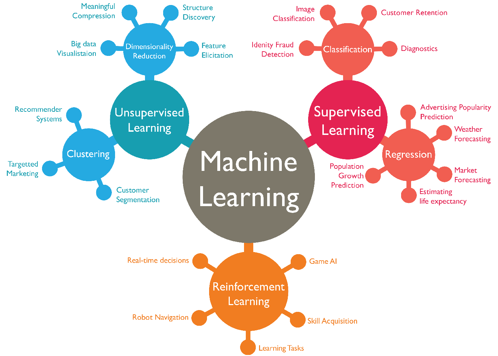

# Machine Learning Training 


Formation pratique au Machine Learning couvrant les principaux paradigmes d'apprentissage supervisé et non supervisé, à travers trois projets complets sur des données réelles.



---

## Vue d'ensemble

| Projet | Type | Algorithmes clés | Déploiement |
|---|---|---|---|
| [Churn Classification](#1--churn-classification) | Supervisé — Classification | KNN, Logistic Regression, Decision Tree, Random Forest, **XGBoost** | FastAPI + Streamlit |
| [Prices Regression](#2--prices-regression) | Supervisé — Régression | Linear, Lasso, Ridge, **ElasticNet**, Decision Tree, Random Forest, XGBoost, SVR | Notebook |
| [Crimes Clustering](#3--crimes-clustering) | Non supervisé — Clustering | **K-Means**, Clustering Hiérarchique, GMM | Notebook |

---

## Structure du dépôt

```
├── Churn Classification/
│   ├── churn_analysis.ipynb        # Analyse complète et modélisation
│   ├── Churn_Modelling.csv         # Dataset (10 000 clients bancaires)
│   ├── requirements.txt
│   ├── backend/
│   │   ├── app.py                  # API REST FastAPI
│   │   └── prepare_model.py        # Entraînement et export des artefacts
│   └── frontend/
│       └── frontend.py             # Interface Streamlit
├── Prices Regression/
│   ├── eda.ipynb                   # Analyse exploratoire
│   ├── prices_regression.ipynb     # Modélisation et comparaison
│   ├── train.csv / test.csv        # Dataset Ames Housing
│   └── data_description.txt        # Dictionnaire des 80 variables
├── Crimes Clustering/
│   ├── crimes_clustering_analysis.ipynb  # Analyse complète
│   └── crimes.csv                        # Dataset (50 États américains)
└── Supports/
    ├── introduction.pdf
    ├── supervised.pdf
    └── unsupervised.pdf
```

---

## Prérequis

- Python 3.10+
- Jupyter Notebook / JupyterLab

```bash
pip install pandas numpy matplotlib seaborn scikit-learn xgboost umap-learn kneed scipy statsmodels
# Pour le projet Churn (déploiement)
pip install -r "Churn Classification/requirements.txt"
```

---

## Projets

### 1 · Churn Classification

> Prédire si un client bancaire va quitter la banque (churn), puis déployer le modèle sous forme d'application web.

**Dataset :** 10 000 clients bancaires · 14 variables · Taux de churn : 20.37 %

**Pipeline ML :**
- Preprocessing : LabelEncoder (Gender), OneHotEncoder (Geography), StandardScaler
- Comparaison de 5 modèles baseline, puis fine-tuning GridSearchCV (5-fold CV, scoring F1)
- Sélection de features par SelectKBest : `Age`, `Geography_Germany`, `IsActiveMember`, `Balance`, `Gender`

**Résultats :**

| Modèle | Accuracy | F1-Score | ROC-AUC |
|---|---|---|---|
| KNN | 0.824 | 0.443 | 0.753 |
| Logistic Regression | 0.808 | 0.284 | 0.775 |
| Decision Tree | 0.856 | 0.531 | 0.842 |
| Random Forest | 0.862 | 0.575 | 0.855 |
| **XGBoost (Tuned)** | **0.862** | **0.587** | **0.859** |

**Déploiement :** application 3 tiers avec une API FastAPI et une interface Streamlit (formulaire de prédiction + dashboard analytique).

```bash
# Entraîner et exporter le modèle
cd "Churn Classification /backend" && python prepare_model.py

# Lancer le backend (port 8000)
uvicorn app:app --host 127.0.0.1 --port 8000

# Lancer le frontend (port 8501)
cd ../frontend && streamlit run frontend.py
```

Documentation API : `http://localhost:8000/docs`

---

### 2 · Prices Regression

> Prédire le prix de vente de maisons résidentielles à Ames, Iowa à partir de leurs caractéristiques physiques et contextuelles.

**Dataset :** Ames Housing (Kaggle) · 1 460 maisons · 80 variables · Prix moyen : 180 921 $

**Pipeline ML :**
- Imputation (médiane / mode), OneHotEncoding → 244 variables après encodage
- Transformation log sur la cible (`SalePrice`) pour corriger l'asymétrie (skewness : 1.88 → 0.12)
- Trois jeux de variables comparés : toutes (244), RFE (50), Backward Elimination (83)
- 8 modèles évalués sur chaque jeu de variables

**Résultats (R² test — meilleur par modèle) :**

| Modèle | Toutes | RFE | BE | Meilleur R² |
|---|---|---|---|---|
| **ElasticNet** | 0.9028 | **0.9067** | 0.9058 | **0.9067** |
| Lasso | 0.9014 | 0.9051 | 0.9034 | 0.9051 |
| Ridge | 0.8976 | 0.9034 | 0.9008 | 0.9034 |
| XGBoost | 0.8923 | 0.8938 | 0.8942 | 0.8942 |
| Linear | 0.8923 | 0.8920 | 0.8909 | 0.8923 |
| Random Forest | 0.8742 | 0.8735 | 0.8697 | 0.8742 |
| SVR | 0.7525 | 0.8475 | 0.8166 | 0.8475 |
| Decision Tree | 0.7690 | 0.7806 | 0.7491 | 0.7806 |

**Champion : ElasticNet + RFE** · R² = 0.9067 · RMSE = 0.1254

---

### 3 · Crimes Clustering

> Segmenter les 50 États américains selon leurs statistiques de criminalité pour identifier des profils géographiques homogènes.

**Dataset :** 50 États · 7 indicateurs de criminalité (meurtres, vols, agressions…)

**Pipeline ML :**
- Réduction de dimensionnalité pour visualisation : PCA, UMAP, t-SNE
- Détermination du k optimal : méthode du coude + scores silhouette (k = 4)
- Comparaison de 3 méthodes de clustering

**Résultats :**

| Méthode | Silhouette Score |
|---|---|
| **K-Means** | **0.2836** |
| Clustering Hiérarchique (Ward) | 0.2330 |
| Gaussian Mixture Model | 0.2114 |

**Profils identifiés par K-Means (k = 4) :**

| Cluster | Profil | États représentatifs |
|---|---|---|
| 0 | Forte criminalité urbaine | Californie, Floride, New-York |
| 1 | Zones rurales sûres | Iowa, Vermont, Dakota du Nord |
| 2 | Sud violent (meurtres élevés) | Louisiane, Mississippi, Alabama |
| 3 | Nord-Est modéré | Connecticut, Massachusetts |

---

## Concepts couverts

**Supervisé — Classification**
- Encodage des variables catégorielles (Label / OneHot)
- Déséquilibre de classes et choix du scoring (F1, ROC-AUC)
- Hyperparameter tuning avec GridSearchCV et cross-validation
- Sélection de features (SelectKBest, f_classif)

**Supervisé — Régression**
- Transformation de la variable cible (log)
- Régularisation L1 (Lasso), L2 (Ridge), L1+L2 (ElasticNet)
- Sélection de features par RFE et Backward Elimination (p-value)
- Comparaison de modèles linéaires vs ensemblistes vs SVM

**Non supervisé — Clustering**
- Standardisation et réduction de dimensionnalité (PCA, UMAP, t-SNE)
- Méthode du coude et score silhouette pour le choix de k
- K-Means, Clustering Hiérarchique (Ward), GMM (BIC/AIC)
- Interprétation métier des clusters via arbres de décision

**Déploiement ML**
- Sérialisation d'un pipeline (pickle)
- API REST avec FastAPI et validation Pydantic
- Interface utilisateur interactive avec Streamlit et Plotly

---

## Stack technique

| Catégorie | Librairies |
|---|---|
| Manipulation de données | `pandas`, `numpy` |
| Visualisation | `matplotlib`, `seaborn`, `plotly` |
| Machine Learning | `scikit-learn`, `xgboost` |
| Réduction de dimensionnalité | `umap-learn`, `scikit-learn` (PCA, t-SNE) |
| Statistiques | `scipy`, `statsmodels` |
| Déploiement | `fastapi`, `uvicorn`, `streamlit`, `pydantic` |
